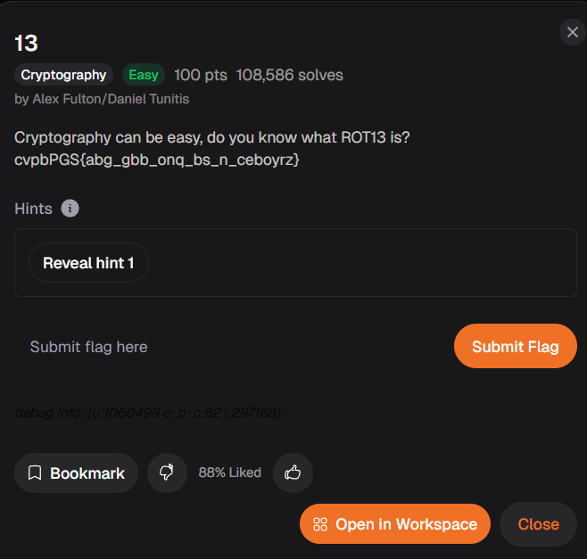

# 13 (Cryptography)

## Goal

ถอดข้อความที่ถูกเข้ารหัสด้วย `ROT13`

## The Logic

1. ดูจากชื่อโจทย์และลักษณะข้อความแล้วเดาได้ว่าเป็นการหมุนตัวอักษร 13 ตำแหน่ง
2. นำ ciphertext ไปถอดด้วย `ROT13`
3. อ่านผลลัพธ์ที่ได้เพื่อดึงข้อความหรือ flag ออกมา

## New Loot

- `ROT13` คือ Caesar cipher ที่เลื่อนตัวอักษร 13 ตำแหน่ง
- ถอดซ้ำอีกครั้งจะกลับไปเป็นข้อความเดิม
