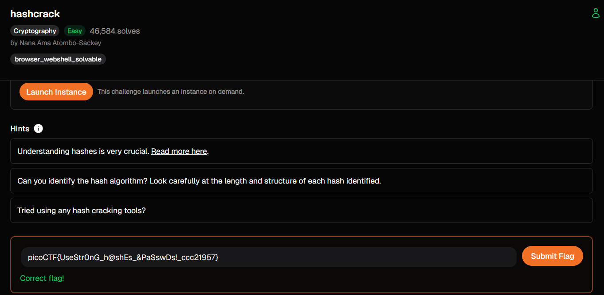

# hashcrack (Cryptography)

## Goal

เชื่อมต่อไปยัง service แล้วถอด hash ที่โจทย์ส่งมาให้

## The Logic

1. เชื่อมต่อด้วย `nc verbal-sleep.picoctf.net 57278`
2. อ่านค่าที่ service ส่งกลับมา ซึ่งเป็น hash ของข้อความบางอย่าง
3. นำ hash ไปลองถอดหรือค้นหาด้วยเว็บอย่าง `CrackStation`
4. ส่งคำตอบกลับไปยัง service เพื่อรับผลลัพธ์หรือ flag

## New Loot

- ถ้าเป็นโจทย์ hash เริ่มต้น ให้ลองฐานข้อมูล hash ที่รู้จักก่อน
- `nc` มักถูกใช้เป็นอินเทอร์เฟซง่าย ๆ สำหรับโจทย์ interactive
