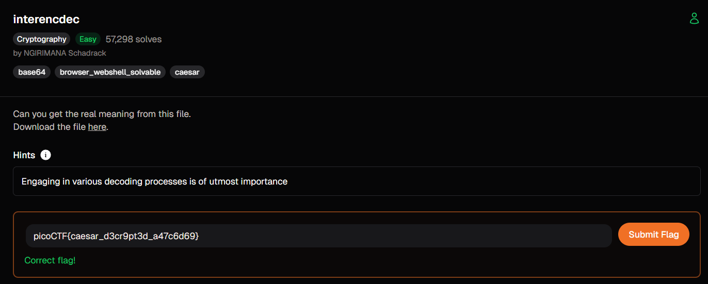

# interencdec (Cryptography)

## Goal

ถอดข้อความที่ถูกเข้ารหัสซ้อนหลายชั้น

## The Logic

1. เริ่มจากข้อความในไฟล์ `.txt` แล้วถอดรหัสด้วย `Base64`
2. จากผลลัพธ์ที่ได้ ให้หยิบเฉพาะข้อความที่อยู่ในเครื่องหมาย quote แล้วถอด `Base64` ซ้ำอีกรอบ
3. ข้อความสุดท้ายยังถูกเลื่อนตัวอักษรอยู่ จึงถอดต่อด้วย `ROT19`
4. เมื่อถอดครบทุกชั้นแล้วจะได้ข้อความจริงหรือ flag

## New Loot

- โจทย์ที่มีชื่อสื่อถึง encode/decode มักซ้อนหลายชั้น
- การแยกเป็น pipeline ทีละชั้นช่วยลดความสับสนและตรวจผลลัพธ์ได้ง่ายกว่า
