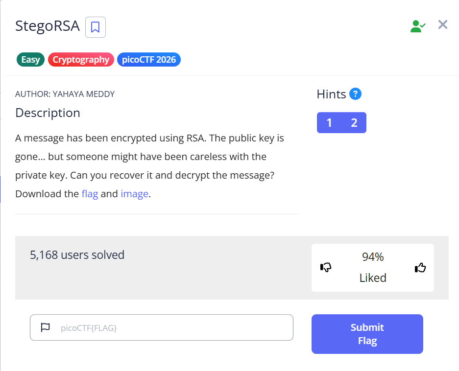

# StegoRSA (Cryptography)

**Flag:** `picoCTF{rs4_k3y_1n_1mg_3a1b0454}`

## Goal

ดึงความลับที่ซ่อนอยู่ในไฟล์ภาพ แล้วใช้มันถอดข้อความที่เข้ารหัสด้วย RSA

## The Logic

1. ตรวจสอบ metadata ของไฟล์ภาพก่อน เพื่อหาว่ามีข้อมูลซ่อนอยู่หรือไม่
2. พบ comment ใน metadata แล้วนำไปถอดด้วย `Hex Decode`
3. ข้อมูลที่ได้คือ `Private Key`
4. นำ private key ไปใช้ในขั้นตอนถอดรหัส RSA
5. ตอนถอด ciphertext ให้เลือก scheme เป็น `RSAES-PKCS1-V1_5` แล้วอ่าน flag ที่ได้

## New Loot

- metadata ของรูปภาพอาจซ่อนกุญแจหรือเบาะแสสำคัญไว้
- ถ้าโจทย์ผสม stego กับ crypto ควรแยกดูทีละชั้น ไม่รีบกระโดดไปถอดรหัสทันที
