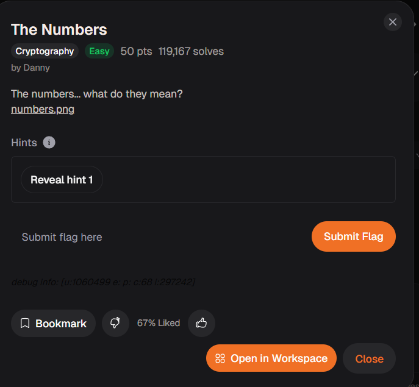

# The Numbers (Cryptography)

## Goal

แปลงชุดตัวเลขให้กลับมาเป็นข้อความ

## The Logic

1. สังเกตว่าข้อมูลเป็นลำดับตัวเลขที่คั่นเป็นช่วง ๆ
2. แปลงตัวเลขตามรูปแบบ `A=1, B=2, C=3 ... Z=26`
3. ต่อผลลัพธ์กลับเป็นข้อความเพื่อหา flag

## New Loot

- `A1Z26` เป็น encoding พื้นฐานที่เจอบ่อยในโจทย์เริ่มต้นสาย Crypto
- ถ้าเห็นเลขอยู่ในช่วง `1-26` ให้ลอง mapping เข้าตัวอักษรก่อนเสมอ
