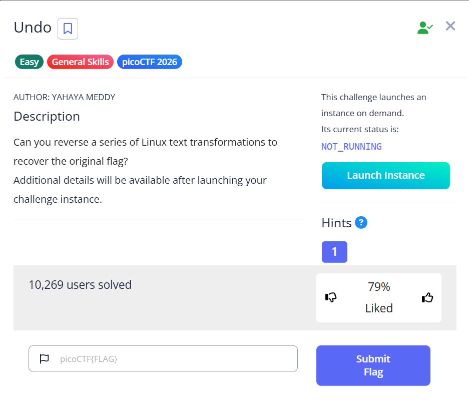

# Undo (General Skills)



**Flag:** `picoCTF{Revers1ng_t3xt_Tr4nsf0rm@t10ns_3a939318}`

## Goal

ย้อนกระบวนการแปลงข้อความกลับจากลำดับ transform ที่โจทย์ใช้

## The Logic

1. ถอดข้อความชั้นแรกด้วย `base64 -d`
2. กลับลำดับข้อความด้วย `rev`
3. แปลงอักขระ `-` กลับเป็น `_`
4. แปลงวงเล็บ `()` กลับเป็น `{}` ด้วย `tr`
5. ถอด `ROT13` ด้วย `tr 'a-zA-Z' 'n-za-mN-ZA-M'`

ตัวอย่างคำสั่ง:

```bash
echo '<ciphertext>' | base64 -d | rev | tr '-' '_' | tr '()' '{}' | tr 'a-zA-Z' 'n-za-mN-ZA-M'
```

## New Loot

- โจทย์สาย General Skills มักวัดการต่อ command line หลายตัวเข้าด้วยกัน
- การทำ transform ย้อนลำดับจากขั้นตอนสุดท้ายกลับมาเป็นวิธีที่ตรงที่สุด
