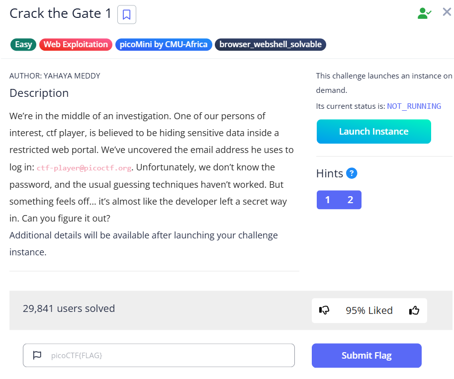

# Crack the Gate 1 (Web Exploitation)

**Flag:** `picoCTF{brut4_f0rc4_b3a957eb}`

## Goal

หาเงื่อนไขลับของหน้า login และส่ง request ให้ตรงตามที่ระบบต้องการ

## The Logic

1. เปิดหน้า login แล้วดู source code ด้วย `Ctrl+U`
2. พบข้อความลับที่ซ่อนอยู่ เมื่อนำไปถอด `ROT13` จะได้ `X-Dev-Access: Yes`
3. ค่านี้เป็น `HTTP Header` ที่เซิร์ฟเวอร์ใช้ตรวจสอบ
4. ใช้ extension อย่าง `ModHeader` เพื่อเพิ่ม header `X-Dev-Access: Yes`
5. กลับไปล็อกอินด้วยอีเมล `ctf-player@picoctf.org` แล้วรับ flag

## New Loot

- อย่ามองข้าม source code ของหน้าเว็บ เพราะหลายโจทย์ซ่อน hint ไว้ตรงนี้
- Header-based access control ที่ตรวจแค่ค่าจาก client มักถูกปลอมแปลงได้ง่าย
