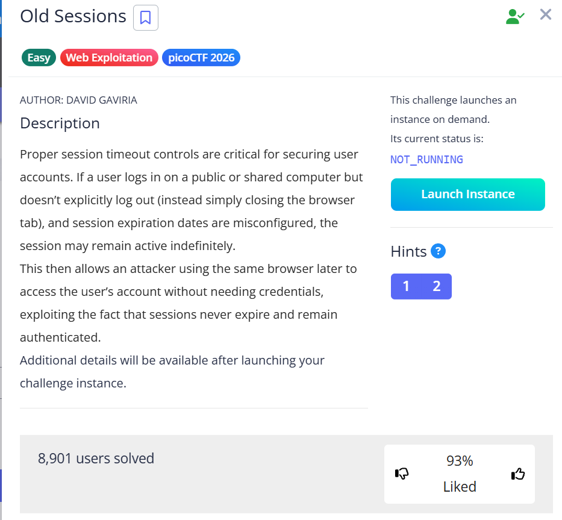

# Old Sessions (Web Exploitation)

**Flag:** `picoCTF{s3t_s3ss10n_3xp1rat10n5_10f20509}`

## Goal

หา session ของผู้ใช้ที่มีสิทธิ์สูงกว่าแล้วสลับมาใช้งาน

## The Logic

1. สมัครบัญชีธรรมดาและล็อกอินเข้าเว็บ
2. เปิด Developer Tools แล้วไปดูที่ `Application` หรือ `Storage` เพื่อดู cookie/session ของตัวเอง
3. ในหน้าเว็บมี hint ถึง path `/sessions` ให้ลองเปิด path นี้ตรง ๆ
4. เมื่อพบ session value ของ `admin` ให้นำค่าดังกล่าวมาแทน session ของเรา
5. รีเฟรชหน้าเว็บเพื่อเข้าเป็น admin และรับ flag

## New Loot

- ถ้าเว็บเปิดเผย session ฝั่งเซิร์ฟเวอร์หรือ path ภายในโดยไม่ป้องกัน properly จะถูก hijack ได้ง่าย
- ข้อความ hint เล็ก ๆ บนหน้าเว็บมีค่ามาก โดยเฉพาะ path ที่ไม่ถูกลิงก์ตรง
